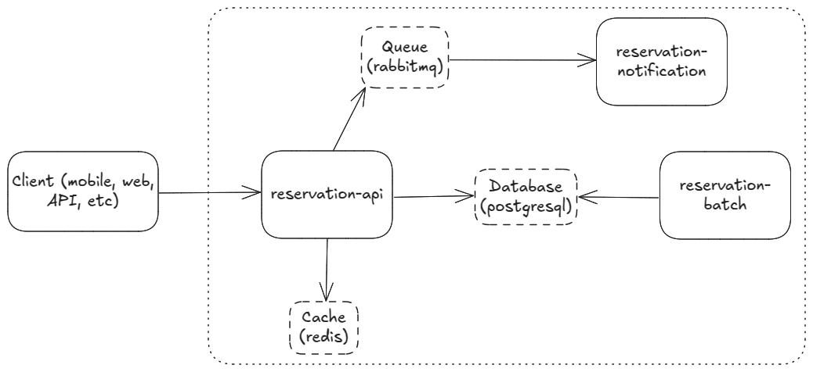

# Reservation System

## Architecture


### Reservation-api
The reservation-api microservice handles HTTP REST requests and enforces core business rules. It interacts with the database for data persistence, uses Redis for caching, and communicates with RabbitMQ to asynchronously send information to the notification service.

This service follows a hexagonal architecture to effectively manage communication with multiple external components and maintain a well-structured business logic.

### Reservation-notification
The reservation-notification microservice receives messages via RabbitMQ and simulates the sending of notifications through multiple channels, such as email and SMS, with the flexibility to support additional channels if needed. It's main responsibility is to inform users about changes in the reservation.

### Reservation-batch
The reservation-batch microservice periodically runs batch executions to update the status of expired reservations, ensuring data consistency and proper reservation lifecycle management.

## Languages and tools
- Backend: Java 21, Spring Boot
- Database: PostgreSQL
- Queue: RabbitMQ
- Cache: Redis
- Build and run: Maven, Docker, scripts `.sh` (unix) and `.bat` (windows)

## How to run
#### Requirements: Java 21, Docker, Docker Compose

Steps:
- If an unix machine execute `./build-and-run.sh`. You may have to give it permission: `chmod +x build-and-run.sh`
- If an windows machine execute `build-and-run.bat`

The script will build all projects and then call docker-compose to build the images and execute all the services.

## Reservation logic
To ensure data consistency I placed the logic inside a transaction. Furthermore, to avoid possible concurrency issues I used the optimistic locking strategy.

## Database
The database is automatically created using the `/infrastructure/reservation-db-schema.sql` when you run the application by using the script `build-and-run.sh`. See the `docker-compose.yml` file for more details. If you want to run the database by your own use the .sql file to create the tables, foreign keys, unique constraints, and indexes.

> The application will validate the database model before start!

## Endpoints (with examples)
Create a reservation
```
curl --request POST \
  --url http://localhost:8080/reservations \
  --header 'Content-Type: application/json' \
  --data '{
	"userId": 1,
	"books": [
		{
			"bookId": 1,
			"quantity": 1
		}
	]
}'
```

Find specific reservation
```
curl --request GET \
  --url http://localhost:8080/reservations/1
```

Find all reservation from an user
```
curl --request GET \
  --url 'http://localhost:8080/reservations/user/1?allStatus=false'
```

Pick up a reservation
```
curl --request GET \
  --url http://localhost:8080/reservations/pickup/1
```

Cancel a reservation
```
curl --request DELETE \
  --url http://localhost:8080/reservations/1
```

> You can use also the OpenAPI UI: http://localhost:8080/swagger-ui/index.html